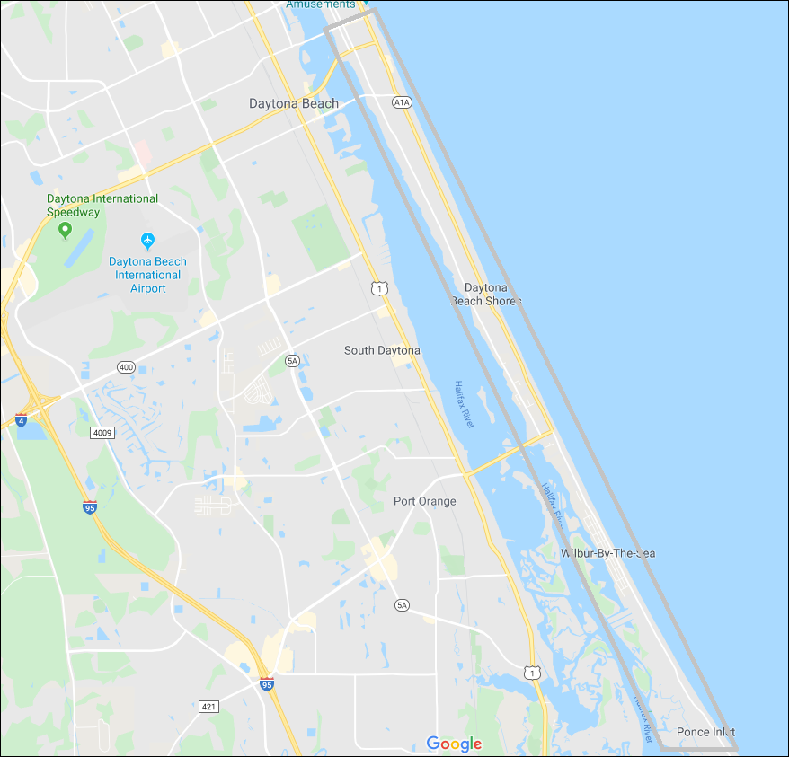
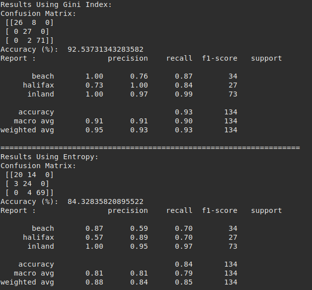
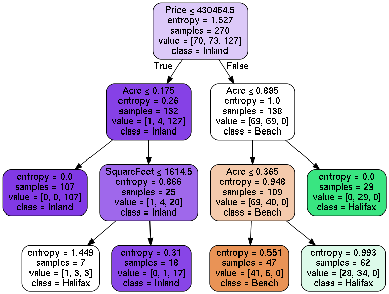
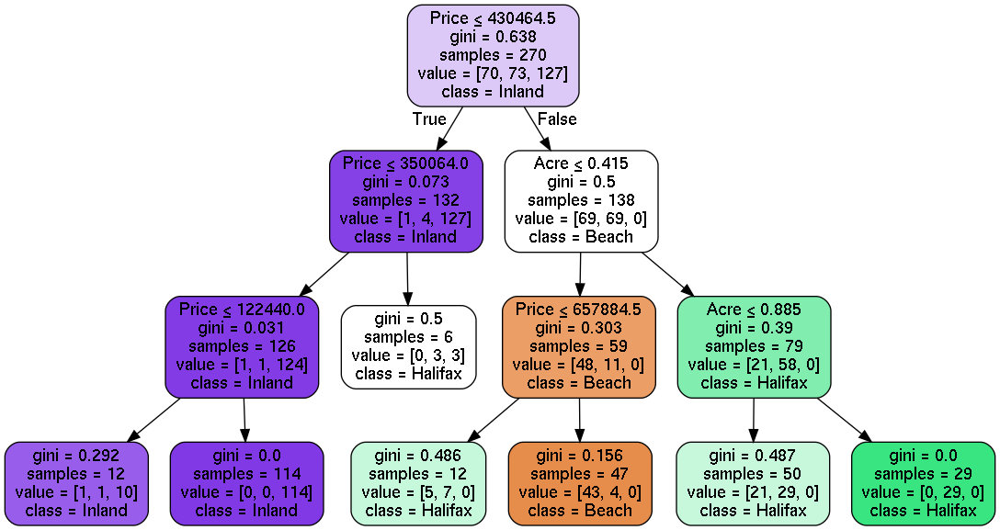

# Daytona Beach Real Estate Appraisal description:
Decision Tree to analyze appraisal prices of the Daytona Beach market based on the "view" of the house. Uses
Scikit-Learn decision tree.

# Objective
To provide an alternative appraisal algorithm to accurately predict if houses in the Daytona Beach area will have a
beachside view, river view, or no view based on five input variables. This project will demonstrate the use of a decision tree 
algorithm using a CSV file, analyzing the data using different criteria (Entropy & Gini) and visualizing it.

# Dataset:
The data selected was retrieved from Zillow. The map of the area that the houses were selected is shown below: 

The western bank has the view of the Halifax river (halifax), the central region has no view (inland), and the eastern 
bank is the Atlantic Ocean (beach). 

# Variables

The feature variables:
1. Number of Bedrooms
2. Number of Bathrooms
3. Interior Squarefeet
4. Listing Price
5. Acreage of lot size

Target Variable:
1. View of house

# Output
My outputs are as followed. Results may differ slightly. 

